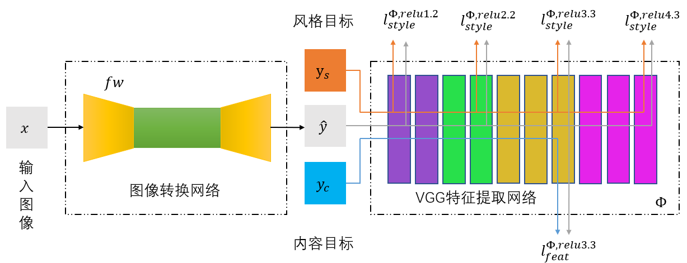
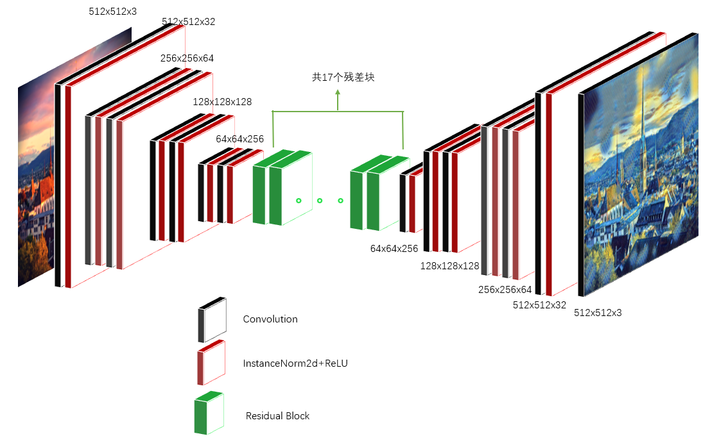
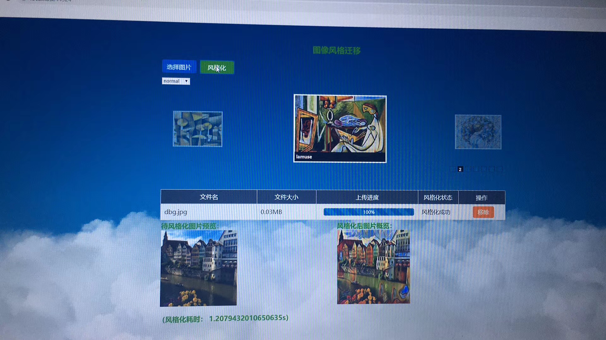

# Lightweight-Image-Style-Transfer-Model
In this work, we design a image transfer network, and use all kinds of network prunning methods to obtain a lightweight fast image style transfer model which is suitable to released into mobile devices.

<front>Figure 1. The overall structure of the fast image style transfer model which consists of two compartments, a image transfer network and a features extraction network.</front>

<front>Figure 2. The proposed image transfer network without being pruned.</front>

<front>Figure 3. Web demo of our work</front>

# Experimental
Experimental data can be downloaded from [here](https://1drv.ms/u/s!Arf6WWsPzHCng0L-LQ4wpMT2Ucmd?e=iQ5ZFI)